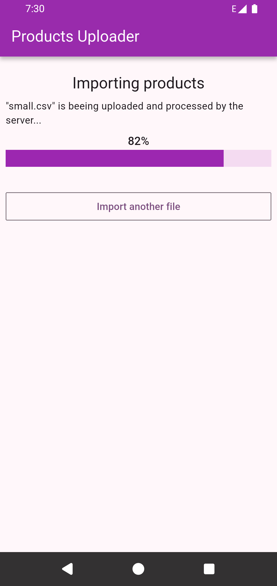
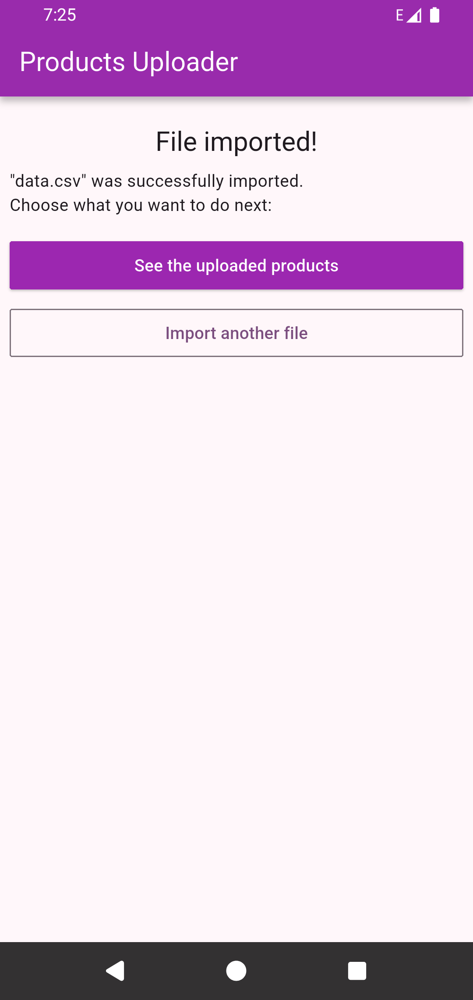
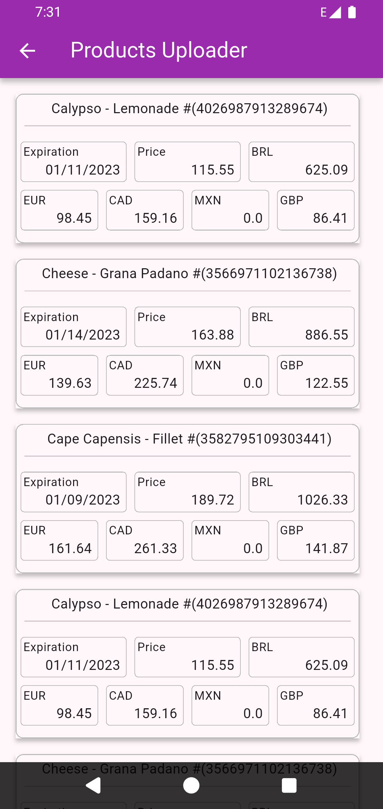

# Products Importer Frontend (Flutter)

A modern, cross-platform mobile application built with Flutter, designed to facilitate the upload of large product data files to the backend and display high-volume datasets efficiently.

## Technology Stack

* **Framework:** Flutter
* **Language:** Dart
* **Target Platforms:** iOS / Android

## Key Architectural & Technical Highlights

This project was developed with a strong emphasis on clean code, architecture, and optimal UI performance.

### 1. Architecture and Design Patterns

The codebase adheres to industry best practices to ensure high maintainability and scalability:

- Core Architecture: Implements the **MVVM (Model-View-ViewModel)** pattern, guided by principles from **Clean Architecture**.  This ensures a clear separation of business logic from the UI.
- State Management: Utilizes the **ChangeNotifier** for simple, scalable, and reactive state management, aligning with recommended Flutter practices.
- Dependency Injection (DI): Employs **GetIt** as a fast and simple **Service Locator** for dependency injection, effectively decoupling service implementations from the UI widgets.

### 2. UI Performance & Responsiveness

Optimized user experience, achieved even when dealing with large datasets and varying screen sizes.

- High-Volume Data Display: Implemented **Infinite Scroll** combined with **Lazy Loading** techniques on list views, ensuring that only visible data is rendered, preventing UI lag when browsing large product catalogs.
- Responsive Design: Comprehensive use of Flutter's layout widgets (e.g., `MediaQuery`) to ensure the application UI gracefully adapts to **different screen sizes** (e.g., mobile portrait, tablet landscape, or web browser).
- Extensive Widget Composition: Rather than building monolithic screens, the UI is constructed from a hierarchy of small, very efficcient stateless widgets. This practice maximizes Flutter's build efficiency, improves the testability of individual UI components, and enforces the Single Responsibility Principle at the visual layer.

 

&emsp;&emsp;&emsp;

&emsp;&emsp;&emsp;

&emsp;&emsp;&emsp;

&emsp;&emsp;&emsp;

&emsp;&emsp;&emsp;

