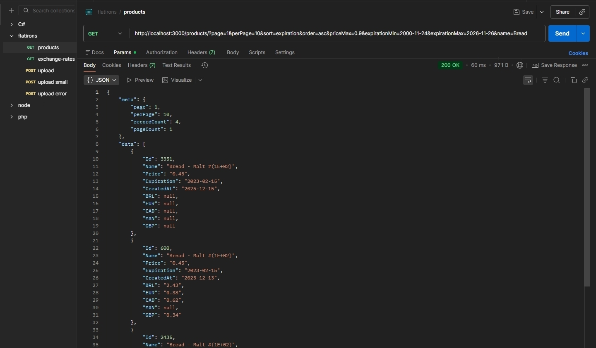

# High-Performance Products Importer Backend

A robust backend solution designed for high-volume data ingestion and management, built to efficiently process large product data files.

 

## Technology Stack

| Component | Technology | Rationale / Usage |
| :--- | :--- | :--- |
| **Language** | TypeScript | Strong typing and modern development practices. |
| **Framework** | NestJS (Node.js) | Enterprise-grade, scalable, and modular architecture. |
| **ORM** | TypeORM | Efficiently managing database entities and transactions. |
| **Database** | MariaDB | Chosen for its high concurrency support and reliability in high-throughput environments. |

 

## Key Features & Technical Highlights

The core focus of this project was achieving **maximum import throughput and speed**.

### 1. Performance & High-Volume Ingestion

To address the requirement for handling big loads of records, streaming input and buffered output were implemented, successfully tested with files exceeding **6 million rows**.

* **File Streaming:** Utilizes Node.js streams to read the input file, avoiding memory overflow issues typically associated with large file reads.
* **Batch Processing:** Instead of individual inserts, records are parsed, buffered into a queue, and committed to the database using highly optimized **Bulk/Batch Insert** operations (via NestJS/TypeORM Query Builders and efficent pre-allocations memory buffers).

### 2. Maintainability & Architecture

The codebase adheres to established engineering best practices, ensuring a clean, scalable, and easy-to-maintain system.

* **Modular Design:** Leveraging NestJS's inherent modularity for clear separation of domain logic and modules.
* **Separation of Concerns:** Strict use of **DTOs (Data Transfer Objects)** for transport, **Services** for business logic, and the **Repository Pattern** for database abstraction.
* **Code Quality:** Adherence to the current best practices, like **Single Responsibility Principle**, **Separation of concerns**, **Inversion of Control**, etc.

 

## Endpoints

- POST products/upload: imports products; accepts a CSV file as multipart/form data.
- GET products: retrieve products; accepts many query parameters for paginations, filtering and sorting:
  - page = _number_: the page to be retrieved
  - perPage = _number_: records período page (default 10, maximum 50)
  - sort = _string_: name of the field to sort by [name / price / expiration]
  - order = _string_: direction of the sorting [asc / desc] - defaults to **asc**
  - name = _string_: filters records where name starts with (case insensitive)
  - priceMin = _number_: filters records with **price** equal or greater than
  - priceMax = _number_: filters records with **price** equal or lesser than
  - expirationMin = _date_: filters records with **expiration** equal or greater than; format accepted: yyyy-mm-dd
  - expirationMax = _date_: filters records with **expiration** equal or lesser than; format accepted: yyyy-mm-dd

  

&emsp;&emsp;&emsp;